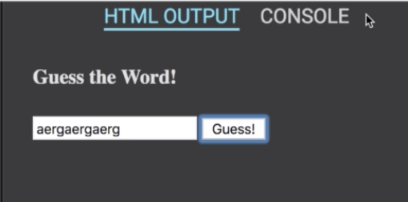
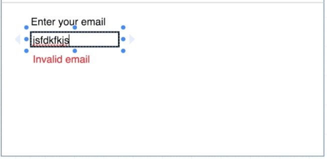

# Stream を学習する

## Stream とは

Stream については[この記事](https://qiita.com/kabochapo/items/8738223894fb74f952d3)を見てもらうとわかりやすいです．
基本的には，ざっくり以下のような感じが掴めていれば，この後は理解できると思います．

- sink というものがあって
- sink に何かしらを入れて(add)
- sink に入れたものを加工して(transform)
- それを stream から取り出して(listen)，処理する

## Stream について，コードを書きながら学ぶ

### 基本的な流れを学ぶ

- [DartPad](https://dartpad.dartlang.org/)を使います

- コードを全て削除します
- sink に add します

```dart
import 'dart:async';

class Cake {

}
class Order {
    String type;
    Order(this.type);
}

void main() {
    final controller = new StreamController();

    final order = new Order('banana');
    // sinkに追加
    controller.sink.add(order);
}
```

- StreamTransformer を追加します
  - StreamTransformer は sink に流れてきたデータを加工するためのものです．
- 以下で使用している `map` は何をしているでしょうか?調べてみましょう．

```dart
void main() {
    final controller = new StreamController();

    final order = new Order('banana');
    // データ加工の内容
    final baker = new StreamTransformer.fromHandlers(
        handleData: (cakeType, sink) {
            if (cakeType == 'chocolate') {
                sink.add(new Cake());
            } else {
                sink.addError('I cant bake that type!!');
            }
        }
    );
    controller.sink.add(order);
    // 実際にtransformerを適用
    controller.stream
        .map((order) => order.type)
        .transform(baker)
}
```

- listen することで，データに応じて print していきます

```dart
void main() {
    final controller = new StreamController();

    final order = new Order('banana');
    // データ加工の内容
    final baker = new StreamTransformer.fromHandlers(
        handleData: (cakeType, sink) {
            if (cakeType == 'chocolate') {
                sink.add(new Cake());
            } else {
                sink.addError('I cant bake that type!!');
            }
        }
    );
    controller.sink.add(order);

    controller.stream
        .map((order) => order.type)
        .transform(baker)
        //listenします
        .listen(
            (cake) => print('Heres your cake $cake'),
            onError: (err) => print(err)
        );
}
```

- RUN してみましょう
- その後，order のコンストラクタ引数を`chocolate`に変えてみましょう

### 実際に Stream を利用してプチゲームを作る

- 完成イメージ ↓


- 正解ワードを推測するプチゲーム

  - ユーザーは 4 回まで入力できる
  - 正解ワードを入力できずに 4 回終えると，「Nope, bad gusses」というメッセージがコンソールに出力される
  - 4 回目までに正解ワードを入力すると，「You got it!」というメッセージがコンソールに出力される

- 一旦クリックイベントを利用した簡単なプログラムを作っていきます
- まず HTML を少しだけ書きます

```html
<button>Click Me!</button>
```

- Dart に戻って書いていきます
- Dart は js のように使うこともできます
- `timeout`は`Duration`を設定することで，指定した時間(Duration)が経ったら任意の処理を実行できます．
- なぜ onClick で listen を使うことができるのでしょう？

```dart
import 'dart:html';

void main() {
    final ButtonElement button = querySelector('button');

    button.onClick
        .timeout(
            new Duration(seconds: 1),
            onTimeout: (sink) => sink.addError('You lost!!!')
        )
        .listen(
            (event) {},
            onError: (err) => print(err)
        );
}
```

- 実装を進める前に，Dart の stream における`where`と`take`メソッドについて調べてみましょう
- 実装を進めます
- HTML を変更します

```html
<h4>Guess the word!</h4>
<input />
<button>Guess!</button>
```

- Dart のコードを変更していきます

```dart
import 'dart:html';

void main() {
    final ButtonElement button = querySelector('button');
    // インプットボタンの要素を取得します
    final InputElement input = querySelector('input');

    button.onClick
        .take(4)
        .where((event) => input.value == 'banana')
        .listen(
            (event) => print('You got it!'),
            onDone: () => print('Nope, bad guesses.')
        );
}
```

### 実際に Stream を利用してバリデーションフォームを作る

- 完成イメージ ↓




- まずは HTML を書いていきましょう

```html
<h4>Enter your email</h4>
<input />
<div style="color: red;"></div>
```

- Dart を書いていきます
- 書いたら実際にフォームに適当に入力しながら，コンソールを見てみましょう

```dart
import 'dart:html';

void main() {
    final InputElement input = querySelector('input');
    final DivElement div = querySelector('div');

    input.onInput
        .listen((dynamic event) => print(event.target.value));
}
```

- バリデーションフォームを作るために，Dart のコードを変えていきます
- 例えば，新しいStreamTransformerを追加して，onInputに新しいtransformをチェインすることで，多様なバリデーションを実現することもできます（今はしません）．

```dart
import 'dart:html';
import 'dart:async';

void main() {
    final InputElement input = querySelector('input');
    final DivElement div = querySelector('div');

    final validator = new StreamTransformer.fromHandlers(
        handleData: (inputValue, sink) {
            if (inputValue.contains('@')) {
                sink.add(inputValue);
            } else {
                sink.addError('Enter a valid email');
            }
        }
    );
    input.onInput
        .map((dynamic event) => print(event.target.value));
        .transform(validator)
        .listen(
            (inputValue) => div.innerHtml = '',
            onError: (err) => div.innerHtml = err
        );
}
```

- 完成です．お疲れ様でした
